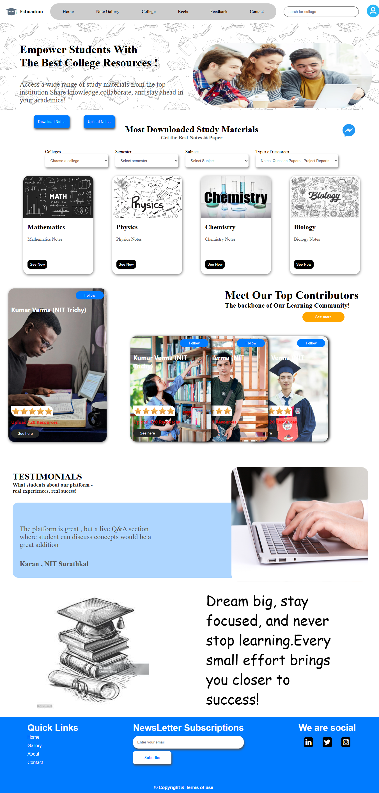

# 🎓 College Resource Sharing Platform – UI Design

A simple and clean front-end design for a **College Resource Sharing Platform** that helps students share notes, applications, and resources efficiently.

---

## 🛠 Tech Stack Used

- **HTML**
- **CSS**

---

## 📸 Screenshots

### 💻 Desktop View

#### 🏠 Home Page  

#### 📚 Notes Page  

#### 📝 Application Page  

---

